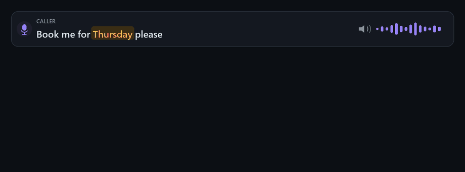
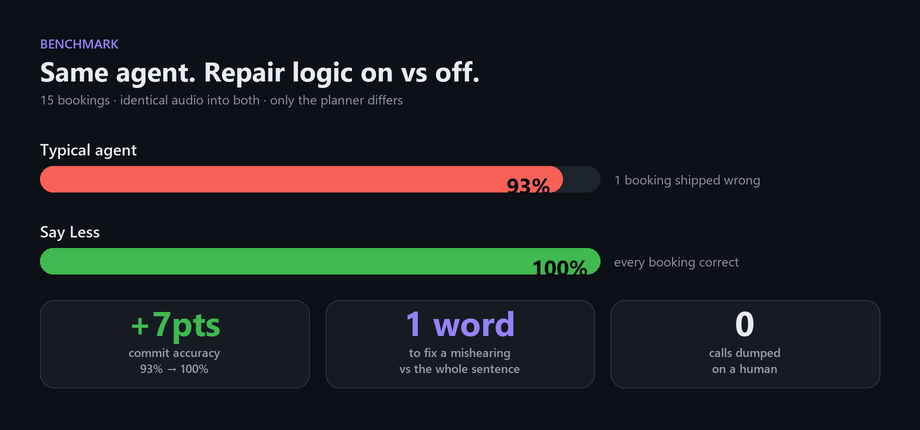

<div align="center">

# 🎙️ Say Less

### The voice agent that asks about the **one word it missed** — not the whole sentence.

[](LICENSE)
[](pyproject.toml)
[](https://www.assemblyai.com)
[](app/server.py)
[](tests/)
[](https://lablab.ai/ai-hackathons/assemblyai-voice-agent-hackathon)
[](https://say-less-xh3x.onrender.com)

**[🚀 Live Demo](https://say-less-xh3x.onrender.com)** · **[How it works](#how-it-works)** · **[The benchmark](#the-benchmark)** · **[Try it](#try-it)**

</div>

<div align="center">
  
</div>

---

## The 15-second story

You call your dentist. There's traffic behind you, the line is bad. You say *"Thursday."*

The robot says: **"Sorry, I didn't catch that. Could you repeat that?"**

So you say the whole thing again. And it mishears the same hard word again. You start to wish you'd never called.

A **human** receptionist would never do that. They heard *most* of it — they just missed one word. So they ask the obvious question:

> ### "Tuesday or Thursday?"

You say one word. You're booked. That's the entire idea behind **Say Less**.

## How it works

Most agents re-ask on **low confidence** — *"how sure am I about these sounds?"* Say Less asks something smarter: *"does this word actually belong here?"*

For fields with a known list of valid answers — a **day** of the week, a **service** from the menu, a **surname** on the booking — Say Less does three things the moment your turn ends:

| Step | | |
|:---:|---|---|
| **1** | **Catch** | The value it heard isn't on the list — even if the recogniser was *confident*. That's the failure that quietly books the wrong thing. |
| **2** | **Recover** | It finds the closest real menu item by how it *sounds*, not how it's spelled. |
| **3** | **Ask small** | It asks the most specific question it can, and no bigger: |

```
   confident ─────────────────────────────────────────────► unsure
   ┌───────────────┬──────────────────┬───────────────┬───────────────┐
   │ name one       │ offer two         │ ask the group │ ask again     │
   │ "kids cut?"    │ "Tuesday or Thu?" │ "Which day?"   │ "Sorry?"      │
   └───────────────┴──────────────────┴───────────────┴───────────────┘
    ▲ Say Less starts as far left as it can        ▲ every other agent lives here
```

The answer it offers is **never made up**. AssemblyAI's real-time model gives per-word confidence — the raw signal a normal agent throws away — and Say Less pairs it with *your own list of valid answers* to work out what you probably meant. That's why it can say *"Tuesday or Thursday?"* instead of *"huh?"*

## The benchmark

Same agent, run twice on the **same audio** — once with the repair logic on, once off. The only thing that changes is the planner.

<div align="center">
  
</div>

The gap is one booking a normal agent gets **silently wrong** — it heard something a letter off the menu, never noticed, and booked it anyway. Say Less caught it and fixed it in a single word. That run is 15 synthesized, phone-degraded clips; the [full results and per-call records](eval_results.json) are committed and replay with no API key.

It also runs on **26 real human recordings** — two speakers on different phones outdoors, plus clips from the public [SLURP](https://github.com/pswietojanski/slurp) corpus ([results](eval_results_real.json)):

| 26 real recordings | Baseline | Say Less |
|---|---|---|
| Commit accuracy | 96% | **100%** |
| Words re-said per booking | 0.77 | **0.04** |
| Escalated to a human | 4% | **0%** |

One item drives that gap, and it's the exact case the design exists for: the recogniser wrote a spoken hour as `9 AM`, which isn't on the menu. The baseline can't see that, so it asked again, and again, and gave up after 5 turns and 20 re-said words. Say Less matched the digits to `nine am`, asked one question, and booked it on a one-word yes.

Mixed with café noise, both arms land at 96% — the one clip either loses had the day word destroyed outright (`next saturday` → `max out today`), which no membership check can recover. That's the honest shape of it: repair pays when a wrong value survives, and can't help when the word is gone.

> **What that's worth.** At a 93% → 100% accuracy gap, roughly **667 wrong bookings per 10,000 calls** get caught before they ship. At a typical **\$7–12** to have a human clean up one wrong booking ([industry figures, 2026](https://www.retellai.com/blog/call-center-outsourcing-costs)), that's **\$4,700–\$8,000 saved per 10,000 calls** — before you count the customer who got the wrong slot and simply never came back.

## Try it

### Live demo

The demo is deployed and live at:

👉 **[https://say-less-xh3x.onrender.com](https://say-less-xh3x.onrender.com)**

> *Hosted on Render's free tier. Hold the push-to-talk button and speak. If the instance was idle, please allow 30–60 seconds for the initial wake-up.*

### Reproduce benchmarks locally

Reproduce every number above with **no API key** — the results replay from committed recordings:

```bash
python -m venv .venv && source .venv/Scripts/activate   # .venv\Scripts\activate on Windows cmd
pip install -e ".[dev]"

pytest -v                              # 97 tests — no network, no key
python -m evalharness.run --offline    # replays the recordings, reprints the benchmark
```

Want to run the live demo locally? Add an AssemblyAI key and run the server:

```bash
cp .env.example .env    # paste your ASSEMBLYAI_API_KEY
uvicorn app.server:app --reload         # open http://localhost:8000 and hold to talk
```

Or in Docker:

```bash
docker build -t say-less .
docker run -p 8000:8000 -e ASSEMBLYAI_API_KEY=your_key say-less
```

## Deploy

The live demo streams microphone audio over one long-lived WebSocket for the whole call, so it needs a host that runs a persistent server process.

- **Render (Live Deployment):** Deployed and active at **[https://say-less-xh3x.onrender.com](https://say-less-xh3x.onrender.com)** via `render.yaml` and `Dockerfile`.
- **Any container host** (Render, Fly.io, Koyeb, Railway, Cloud Run): use the `Dockerfile`. Set `ASSEMBLYAI_API_KEY`; the server listens on `$PORT` (default 8000).
- **Render**, without Docker: `render.yaml` is a ready blueprint.
- **Vercel** builds and serves the page (`vercel.json`, `api/index.py`), but its serverless functions do not carry this app's WebSocket reliably. In testing, audio reached the server and the transcript came back, yet the agent's reply never did. Use Vercel for a static preview only.

For recording a demo, `docs/submission/live-demo-script.md` has exact lines, checked against the live pipeline.

## Built with

**AssemblyAI Universal-Streaming** (real-time speech-to-text with per-word confidence) · **AssemblyAI LLM Gateway** · **FastAPI** · a plain browser push-to-talk front end. Built for the **[AssemblyAI Voice Agent Hackathon](https://lablab.ai/ai-hackathons/assemblyai-voice-agent-hackathon)**.

Deeper reading: **[live demo](https://say-less-xh3x.onrender.com)** · [the spec](docs/SPEC.md) · [live status & decision log](docs/STATUS.md) · [why it's designed this way](docs/council/verdict.md) · [the research behind it](docs/research-3w-scan.md)

<div align="center">
<br>
<b>Say Less</b> — the agent asks about the word, not the sentence.
</div>
